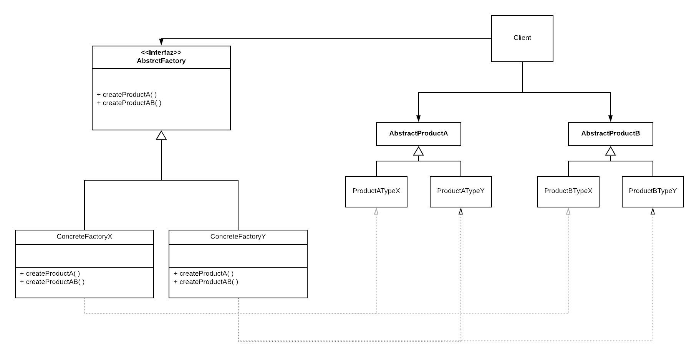

# Patrones de Diseño de Software
## Patrones de Creación
1. **Fábrica abstracta**
    - **Nombre:** Abstract Factory
    - **También conocido como:** Kit
    - **Intención:** Provee una interfaz para la creación de familias de objetos realionados o dependientes sin especificar sus clases concretas.
    - **Motivación:** Puede usarse en la creación de interfaces de bases de datos, la cual tiene fabricas concretas para manejar diferentes motores de bases de datos, por ejemplo: Oracle, PostgreSQL, etc. Facilitando el agregar un nuevo tipo de base de datos.
    - **Aplicabilidad** El patrón Abstract Factory debe ser usado cuando:
        - El sistema debe ser independiente de como sus productos son creados, compuestos y representados.
        - El sistema debe ser configurado con uno de múltiples familias de productos.
        - Una familia de objetos relacionados es diseñada para ser usada en conjunto y se debe garantizar esa restricción.
        - Se desea proveer una librería de clases de productos y se desea revelar sus interfaces, no sus implementaciones.
    -  **Estructura**
        
    - **Participantes:**
        - AbstractFactory: declara una interfaz para las operaciones que crean objetos de productos abstractos.
        -ConcreteFactory: implementa las operaciones para crear productos de objetos concretos.
        - AbstractProduct: declara una intefaz para un tipo de objeto de producto.
        - ConcreteProduct: define un objeto de producto a ser creado por la correspondiente fabrica concreta (ConcreteFactory). Implementa la interfaz AbstractProduct.
        - Client: usa solo interfaces declaradas por AbstarctFactory y AbstractProduct.
    - **Código de ejemplo:** 
            ```java

            public interface AbstractFactory{
    
                public AbstractProductA constructA();
                public AbstractProductB constructB();
    
            }

            public class ConcreteFactoryX implements AbstractFactory{
    
                public AbstractProductA constructA(){
                    return new ProductATypeX();
                }
    
                public AbstractProductB constructA(){
                    return new ProductBTypeX();
                }
            }

            public class ConcreteFactoryY implements AbstractFactory{
                
                public AbstractProductA constructA(){
                    return new ProductATypeY();
                }
                
                public AbstractProductB constructA(){
                    return new ProductBTypeY();
                }
            }

            public abstract class AbstractProductA{
                
            }


            public class ProductATypeX{
                
            }

            public class ProductATypeY{
                
            }


            public abstract class AbstractProductA{
                
            }


            public class ProductBTypeX{
                
            }

            public class ProductBTypeY{
                
            }

            public class Main {
                public static void main(String[] args) throws Exception {
                    
                    int opcion = 1;
                    
                    AbstractFactory fabrica;
                    
                    switch(opcion){
                        case 1:
                            fabrica = new ConcreteFactoryX();
                            break;
                        case 2:
                            fabrica = new ConcreteFactoryY();
                            break;
                    }
                    
                    fabrica.constructA();
                    fabrica.constructB();
                }
            }
            ```


